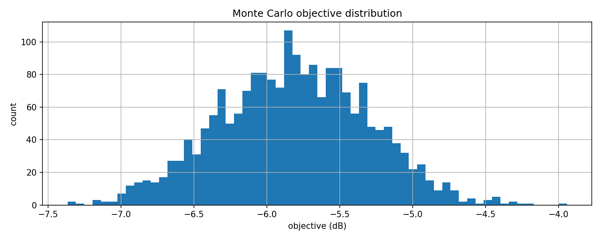
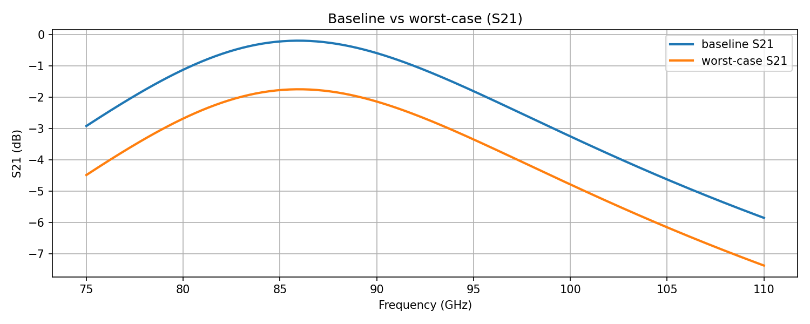

# CChannel Analysis Lab (S-parameter + Statistical Worst-case)

## What this proves (S-parameter + worst-case analysis)
- Touchstone (.s2p) ingestion and S-parameter (S21/S11) metric extraction
- Monte Carlo distribution of objective (e.g., S21_min) with percentiles/variance
- Worst-case sample extraction + overlay visualization
- Corner evaluation: do corner combinations capture MC worst-case?
- DOE: 2-level full factorial over variation parameters

## Setup
    python3 -m venv .venv
    source .venv/bin/activate
    python -m pip install -r requirements.txt

## Generate a sample .s2p (for demo/CI)
    python -c "import pathlib, skrf as rf; pathlib.Path('data/real').mkdir(parents=True, exist_ok=True); rf.data.ring_slot.write_touchstone('data/real/sample'); print('wrote: data/real/sample.s2p')"

## Run
    python src/analyze_s2p.py --s2p data/real/sample.s2p --out outputs/analyze1 --fmin 75 --fmax 110
    python src/mc_worst_case.py --s2p data/real/sample.s2p --out outputs/mc1 --n 2000 --seed 7 --fmin 75 --fmax 110
    python src/corner_eval.py --s2p data/real/sample.s2p --out outputs/corner1 --fmin 75 --fmax 110 --mc-report outputs/mc1/mc_report.json
    python src/doe_runner.py --s2p data/real/sample.s2p --out outputs/doe1 --n 500 --fmin 75 --fmax 110

## Screenshots

### Monte Carlo objective distribution

### Baseline vs worst-case overlay

